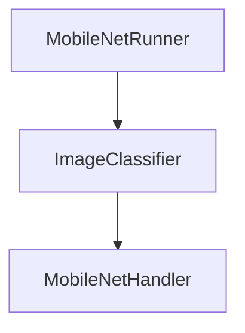
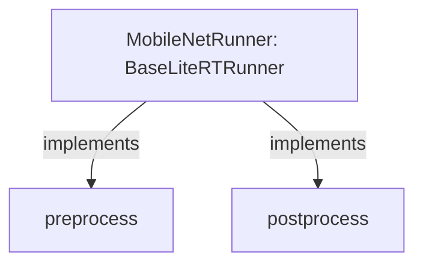

# Walkthrough - Simplified App Inference Architecture

I have simplified the inference architecture in the `app:shared` module by merging the `Runner` and `Handler` layers. This makes the code much flatter, easier to read, and simpler to implement for new models.

## Changes Made

### Tool Module Enhancements
- **[LiteRTHandler.kt](file:///C:/Users/v_yebtang/IdeaProjects/kmplitert/tool/src/commonMain/kotlin/io/github/kmplitert/tool/LiteRTHandler.kt)**:
    - Refactored to use an abstract `compiler` property instead of a constructor parameter.
    - Made the `close()` method open for customization.
    - This allows any class that manages a compiler (like a Runner) to implement `LiteRTHandler` directly.

### App Module Consolidation
- **[BaseLiteRTRunner.kt](file:///C:/Users/v_yebtang/IdeaProjects/kmplitert/app/shared/src/commonMain/kotlin/org/example/kmplitert/runner/BaseLiteRTRunner.kt)**:
    - Now inherits from `LiteRTHandler`.
    - Automatically provides the `run(input)` implementation that orchestrates the entire task flow.
- **[MobileNetRunner.kt](file:///C:/Users/v_yebtang/IdeaProjects/kmplitert/app/shared/src/commonMain/kotlin/org/example/kmplitert/runner/MobileNetRunner.kt)**:
    - Merged the internal `MobileNetHandler` logic directly into the runner.
    - Implementation is now a single, cohesive class.
- **[EfficientDetRunner.kt](file:///C:/Users/v_yebtang/IdeaProjects/kmplitert/app/shared/src/commonMain/kotlin/org/example/kmplitert/runner/EfficientDetRunner.kt)**:
    - Consolidated all object detection logic (preprocessing, postprocessing, NMS) into this class.
- **Deleted `EfficientDetHandler.kt`**: Removed the redundant handler file.

## Verification Results

### Automated Tests
- ✅ **Build**: `:app:shared:assemble` passed successfully.
- ✅ **Tool Tests**: All 35 tests in the `tool` module passed across all targets.

## Implementation Comparison

### Before (3 layers)

### After (1 layer)

This refactoring significantly reduces boilerplate code and makes it very clear where the model-specific logic resides.
