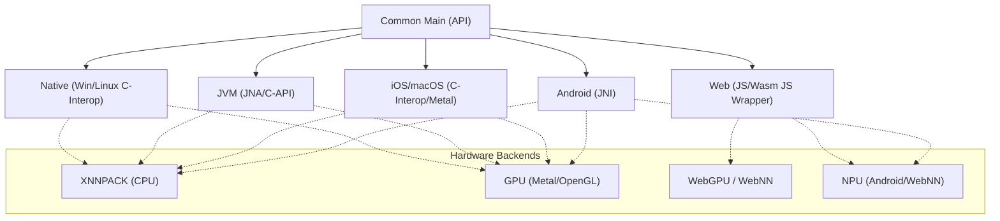

# KMPLiteRT 🚀

[](https://opensource.org/licenses/Apache-2.0)
[](http://kotlinlang.org)
[](https://central.sonatype.com/artifact/io.github.leitingzi/kmplitert-core)
[](https://github.com/leitingzi/kmplitert/actions)

**KMPLiteRT** is a high-performance, type-safe Kotlin Multiplatform (KMP) library that brings **Google LiteRT** (formerly TensorFlow Lite) to the multiplatform ecosystem. It enables developers to execute machine learning models with native performance on Android, iOS, JVM, Native (Desktop), and Web platforms using a single, unified codebase.

---

## 🏗️ Architecture

KMPLiteRT abstracts platform-specific LiteRT runtimes into a consistent Kotlin DSL. It handles the complexity of native interop, memory management, and hardware acceleration backends.



---

## ✨ Key Features

- **Unified Inference Engine**: Orchestrate models, tensors, and signatures using a single API across all targets.
- **Hardware Acceleration**: Deep integration with platform-specific accelerators (Metal, WebGPU, WebNN, XNNPACK).
- **Type-Safe Memory Management**: The `TFBuffer` API provides optimized access to native memory using typed buffers (`Float`, `Int8`, `Int32`, `Int64`, `Boolean`).
- **Runtime Metadata Inspection**: Fully inspect model input/output layouts, dimensions, strides, and buffer requirements.
- **Image Processing Toolkit**: `kmplitert-tool` provides a KMP DSL for image resizing, cropping, and model-ready normalization.
- **Coroutine-First**: Lifecycle methods (`init`, `run`, `read`) are designed for non-blocking asynchronous workflows.

---

## 📊 Platform & Hardware Acceleration Matrix

| Platform | Core Implementation | CPU (XNNPACK) | GPU | NPU / AI Accelerator |
| :--- | :--- | :---: | :---: | :---: |
| **Android** | LiteRT Android SDK (JNI) | ✅ | ✅ (OpenGL) | ✅ (NNAPI/NPU) |
| **iOS / MacOS** | LiteRT C-API + C-Interop | ✅ | ✅ (Metal) | ✅ (CoreML via Metal) |
| **JVM (Desktop)** | JNA + Dynamic Library | ✅ | ✅ (Vulkan/GL) | 🚧 (Planning) |
| **Native (Win/Linux)** | LiteRT C-API + C-Interop | ✅ | ✅ (WebGPU/GL) | 🚧 (Planning) |
| **Web (JS/Wasm)** | `@litertjs/core` Wrapper | ✅ | ✅ (WebGPU) | ✅ (WebNN) |

---

## 📦 Installation

Add the dependencies to your `commonMain` source set in your `build.gradle.kts`:

```kotlin
val kmplitertVersion = "0.1.4"

kotlin {
    sourceSets {
        commonMain.dependencies {
            // Core ML runtime
            implementation("io.github.leitingzi:kmplitert-core:$kmplitertVersion")
            
            // Optional image preprocessing and file utilities
            implementation("io.github.leitingzi:kmplitert-tool:$kmplitertVersion")
        }
    }
}
```

---

## 💡 Core API Guide

### 1. The Compiler Lifecycle
The `LiteRTCompiler` manages the entire lifecycle of a model.

```kotlin
import io.github.leitingzi.kmplitert.core.*

// 1. Create compiler with preferred accelerator
val compiler = LiteRTCompiler(
    filePath = "path/to/model.tflite",
    accelerator = LiteRTAccelerator.GPU 
)

// 2. Initialize (Load model & prepare environment) - Suspending
compiler.init()

// ... perform inference ...

// 3. Close to release native resources
compiler.close()
```

### 2. Typed Tensor Buffers (`TFBuffer`)
KMPLiteRT uses `TFBuffer` to minimize data copying between Kotlin and the native runtime.

```kotlin
val inputs = compiler.getInputBuffers()
val outputs = compiler.getOutputBuffers()

// Typed Write
inputs[0].writeFloat(floatArrayOf(1.0f, 2.5f, 3.1f))

// Execute Inference
compiler.run(inputs, outputs)

// Typed Read (Suspending)
val results = outputs[0].readFloat()
```

### 3. Metadata Inspection
Query the model structure at runtime to adapt your data pipeline.

```kotlin
val tensorType = compiler.getInputTensorType("input_name")
println("Element Type: ${tensorType.elementType}") // FLOAT, INT8, etc.
println("Dimensions: ${tensorType.layout?.dimensions}") // [1, 224, 224, 3]

val requirements = compiler.getOutputBufferRequirements("output_name")
println("Min Buffer Size: ${requirements.bufferSize} bytes")
```

---

## 🖼️ Image Preprocessing Pipeline (`kmplitert-tool`)

Prepare raw image data for computer vision models using the fluent API.

```kotlin
import io.github.leitingzi.kmplitert.tool.*

val modelInputData = LiteRtImage.fromBytes(rawImageData)
    .resize(width = 224, height = 224)
    .centerCrop(224, 224)
    .toRgb()
    .toFloatArray(mean = 127.5f, std = 127.5f) // Normalize to [-1, 1]

inputs[0].writeFloat(modelInputData)
```

---

## 🧪 Model Verification Pipeline (Common Test)

Ensure your model behaves identically across all platforms using our generic testing framework.

```kotlin
class MyModelTest {
    @Test
    fun testConsistency() = runTest {
        val config = ModelTestConfig(
            name = "MobileNet",
            modelBytes = loadResourceAsBytes("mobilenet.tflite"),
            inputs = listOf(TensorExpectation("input", LiteRTElementType.FLOAT, testData = ...)),
            outputs = listOf(TensorExpectation("output", LiteRTElementType.FLOAT, expectedValue = ...))
        )
        // This will run the inference and verify results on Android, JVM, Native, and Web!
        runModelInferenceTest(config) 
    }
}
```

---

## 🛡️ Resource Management & Performance
- **Lifecycle Awareness**: Always call `compiler.close()` (preferably in a `finally` block) to prevent native memory leaks.
- **Buffer Reuse**: Input and output buffers are managed by the `LiteRTCompiler` instance. Do not re-allocate them for every inference; reuse the same `TFBuffer` objects for multiple `run()` calls.
- **Web Platform**: In Web environments (JS/Wasm), the library utilizes `SharedArrayBuffer` (when available) and `TypedArray` views to maximize throughput.

---

## 🤝 Contributing

Contributions are what make the open source community such an amazing place to learn, inspire, and create. Any contributions you make are **greatly appreciated**.

1. Fork the Project
2. Create your Feature Branch (`git checkout -b feature/AmazingFeature`)
3. Commit your Changes (`git commit -m 'Add some AmazingFeature'`)
4. Push to the Branch (`git push origin feature/AmazingFeature`)
5. Open a Pull Request

---

## 📄 License

Distributed under the Apache License, Version 2.0. See `LICENSE` for more information.

---
<p align="center">
  Maintained with ❤️ for the Kotlin Multiplatform community.
</p>
