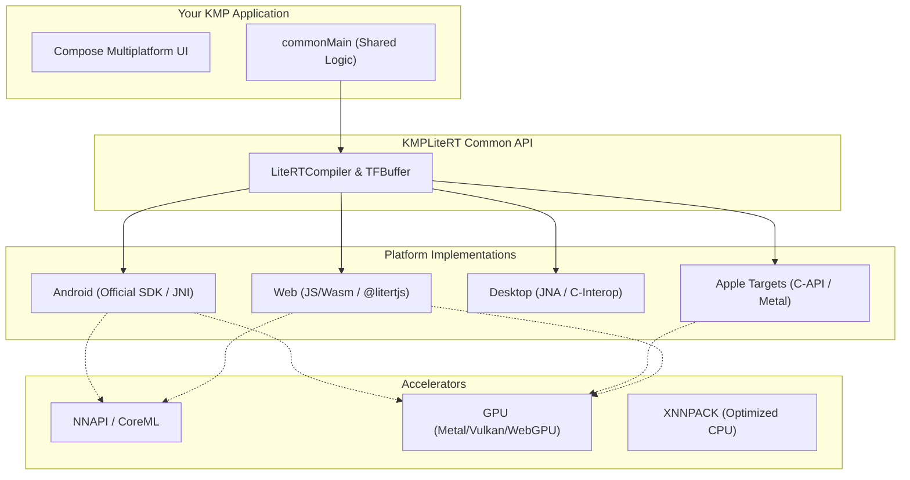

# KMPLiteRT 🚀

<p align="center">
  <b>High-performance, type-safe Kotlin Multiplatform (KMP) library for Google LiteRT (TensorFlow Lite).</b>
  <br>
  <i>Bringing on-device Machine Learning to every screen, from Mobile to Web and Desktop.</i>
</p>

<p align="center">
  <a href="https://opensource.org/licenses/Apache-2.0"></a>
  <a href="http://kotlinlang.org"></a>
  <a href="https://central.sonatype.com/artifact/io.github.leitingzi/kmplitert-core"></a>
  <a href="https://github.com/leitingzi/kmplitert/actions"></a>
</p>

---

## 📖 Table of Contents

- [🌟 Introduction](#-introduction)
- [🏗️ Architecture](#️-architecture)
- [📊 Platform Support & Acceleration](#-platform-support--acceleration)
- [📦 Installation](#-installation)
- [🍎 iOS & Native Setup (Critical)](#-ios--native-setup-critical)
- [🚀 Quick Start (Real-world Examples)](#-quick-start-real-world-examples)
  - [1. Numeric Regression (Celsius to Fahrenheit)](#1-numeric-regression-celsius-to-fahrenheit)
  - [2. Vision Classification (MobileNet)](#2-vision-classification-mobilenet)
- [🛠️ Core API Reference](#️-core-api-reference)
  - [LiteRTCompiler](#litertcompiler)
  - [TFBuffer](#tfbuffer)
  - [LiteRTFileUtils](#litertfileutils)
- [🖼️ Image Processing (LiteRtImage)](#️-image-processing-litertimage)
- [⚡ Performance & Hardware Acceleration](#-performance--hardware-acceleration)
- [🛑 Troubleshooting & FAQ](#-troubleshooting--faq)
- [🗺️ Roadmap](#️-roadmap)
- [🤝 Contributing](#-contributing)
- [📄 License](#-license)

---

## 🌟 Introduction

**KMPLiteRT** is a powerful bridge between the **Google AI Edge LiteRT** (formerly TensorFlow Lite) ecosystem and the **Kotlin Multiplatform** world. While TensorFlow Lite is the industry standard for on-device AI, integrating it into a cross-platform project often involves complex native interop, memory management issues, and inconsistent behavior across platforms.

KMPLiteRT solves these problems by providing:
- **Unified DSL**: Write your inference logic once in `commonMain` and run it anywhere.
- **Zero-Copy Performance**: Direct native memory access via `TFBuffer` ensures minimal overhead.
- **Hardware First**: Seamless integration with **Metal (Apple)**, **NNAPI (Android)**, and **WebGPU (Web)**.
- **Developer Friendly**: Type-safe APIs, coroutine support, and high-level image processing tools.

---

## 🏗️ Architecture

KMPLiteRT abstracts platform-specific runtimes into a consistent Kotlin interface. It doesn't just wrap the APIs; it harmonizes the data types and execution models.



---

## 📊 Platform Support & Acceleration

| Platform | Target Support | Runtime Engine | CPU (XNNPACK) | GPU Accel. | NPU Accel. |
| :--- | :--- | :--- | :---: | :---: | :---: |
| **Android** | API 21+ | Official LiteRT SDK | ✅ | ✅ (GLES) | ✅ (NNAPI) |
| **iOS** | 15.0+ | Native C-API | ✅ | ✅ (Metal) | ✅ (CoreML) |
| **macOS** | 12.0+ | Native C-API | ✅ | ✅ (Metal) | ✅ (CoreML) |
| **Windows** | x64 | Native C-API | ✅ | ✅ (Vulkan) | 🚧 |
| **Linux** | x64 / ARM64 | Native C-API | ✅ | ✅ (OpenGL) | 🚧 |
| **Web** | JS / Wasm | @litertjs/core | ✅ | ✅ (WebGPU) | ✅ (WebNN) |

---

## 📦 Installation

### 1. Add Repository & Version

Add KMPLiteRT to your `commonMain` source set in `build.gradle.kts`.

```kotlin
val kmplitertVersion = "0.1.4" // Replace with latest

kotlin {
    sourceSets {
        commonMain.dependencies {
            // The core ML runtime engine
            implementation("io.github.leitingzi:kmplitert-core:$kmplitertVersion")
            
            // Optional: Image processing & File utilities
            implementation("io.github.leitingzi:kmplitert-tool:$kmplitertVersion")
        }
    }
}
```

### 🤖 Android Setup

On Android, initialization is required to handle assets correctly:

```kotlin
class MyApp : Application() {
    override fun onCreate() {
        super.onCreate()
        // Required for LiteRTFileUtils to load models from assets
        LiteRTFileUtils.init(this)
    }
}
```

---

## 🍎 iOS & Native Setup (Critical)

Dynamic linking is **mandatory** for iOS and Apple targets to support hardware delegates like Metal and to ensure binary compatibility.

### 1. Framework Configuration

In your `shared` module's `build.gradle.kts`, configure your framework to be **dynamic** and set the linker search paths.

```kotlin
kotlin {
    val iosTargets = listOf(iosArm64(), iosSimulatorArm64())
    
    iosTargets.forEach { target ->
        target.binaries.framework {
            baseName = "SharedLib"
            isStatic = false // MUST BE FALSE
            
            // Link against the LiteRT dynamic library
            linkerOpts("-lLiteRt", "-lc++")
            
            // Configure rpath for the system to find the dylib inside the framework
            linkerOpts(
                "-Wl,-rpath,@executable_path/Frameworks",
                "-Wl,-rpath,@loader_path/Frameworks",
                "-Wl,-rpath,@loader_path/../../Frameworks"
            )
        }
    }
}
```

### 2. Automatic Binary Bundling

The `libLiteRt.dylib` must be physically present in your `.framework/Frameworks` directory. You can automate this via Gradle:

```kotlin
tasks.withType<org.jetbrains.kotlin.gradle.tasks.KotlinNativeLink>().configureEach {
    val target = binary.target.konanTarget
    if (target.isApple) {
        doLast {
            val destination = destinationDirectory.get().asFile
            val frameworkDir = File(destination, "${binary.baseName}.framework")
            val frameworksFolder = File(frameworkDir, "Frameworks").apply { mkdirs() }
            
            // Path to where you store the prebuilt LiteRT binaries
            val libPath = File(project.rootDir, "native-libs/ios/${target.name}")
            
            copy {
                from(libPath)
                include("*.dylib")
                into(frameworksFolder)
            }
        }
    }
}
```

---

## 🚀 Quick Start (Real-world Examples)

### 1. Numeric Regression (Celsius to Fahrenheit)

A simple example showing low-level buffer manipulation.

```kotlin
import io.github.kmplitert.core.*
import io.github.kmplitert.tool.LiteRTFileUtils

suspend fun simpleInference(modelBytes: ByteArray) {
    // 1. Prepare model file (cross-platform helper)
    val filePath = LiteRTFileUtils.createFileFromByteArray(modelBytes, "temp_model.tflite")
    
    // 2. Initialize Compiler
    val compiler = LiteRTCompiler(filePath, LiteRTAccelerator.CPU)
    compiler.init()

    // 3. Prepare I/O
    val inputs = compiler.getInputBuffers()
    val outputs = compiler.getOutputBuffers()

    // 4. Input 100°C
    inputs[0].writeFloat(floatArrayOf(100f))

    // 5. Run
    compiler.run(inputs, outputs)

    // 6. Output result
    val result = outputs[0].readFloat()
    println("Result: ${result[0]}°F")

    // 7. Cleanup
    compiler.close()
}
```

### 2. Vision Classification (MobileNet)

A complete vision pipeline example, inspired by the project's `:app` module.

```kotlin
import io.github.kmplitert.core.*
import io.github.kmplitert.tool.*

suspend fun classifyImage(imageBytes: ByteArray, modelBytes: ByteArray) {
    val filePath = LiteRTFileUtils.createFileFromByteArray(modelBytes, "mobilenet.tflite")
    val compiler = LiteRTCompiler(filePath, LiteRTAccelerator.GPU)
    compiler.init()

    // Image Preprocessing Pipeline
    val processedData = LiteRtImage.fromBytes(imageBytes)
        .resize(224, 224) // Resize to model requirement
        .toRgb()          // Ensure RGB format
        .toInt8Array()    // Convert to Quantized Int8

    val inputs = compiler.getInputBuffers()
    val outputs = compiler.getOutputBuffers()

    // Write to native buffer
    inputs[0].writeInt8(processedData)

    // Inference
    compiler.run(inputs, outputs)

    // Post-processing
    val scores = outputs[0].readInt8()
    val topIndex = scores.indices.maxBy { scores[it] }
    
    println("Top Class Index: $topIndex")
    compiler.close()
}
```

---

## 🛠️ Core API Reference

### `LiteRTCompiler`
The heart of the library. It manages the native model lifecycle.
- `init()`: Allocates native resources. Must be called before `run()`.
- `run(inputs, outputs)`: Executes inference.
- `close()`: Releases native memory. **CRITICAL** for preventing leaks.
- `getInputBufferRequirements(name)`: Returns tensor metadata (shape, type, size).

### `TFBuffer`
A type-safe wrapper around native `DirectByteBuffer`.
- `writeFloat(array)` / `writeInt8(array)`: Fast copy to native memory.
- `readFloat()` / `readInt8()`: Fetch results back to Kotlin.
- `byteSize`: The exact capacity of the native buffer.

### `LiteRTFileUtils`
Utility to bridge the gap between KMP resources and LiteRT's file-based requirements.
- `createFileFromByteArray`: Saves bytes to a temporary local file (platform-specific location).

---

## 🖼️ Image Processing (LiteRtImage)

The `kmplitert-tool` module provides a fluent API for image transformation.

```kotlin
val buffer = LiteRtImage.fromBytes(bytes)
    .resize(width, height)
    .toRgb() // or toGrayscale()
    .normalize(mean = 127.5f, std = 127.5f) // For float models
    .toFloatArray() // or writeInt8Buffer(tfBuffer)
```

---

## 🤝 Contributing

Contributions are what make the open-source community such an amazing place to learn, inspire, and create. Any contributions you make are **greatly appreciated**.

1. Fork the Project
2. Create your Feature Branch (`git checkout -b feature/AmazingFeature`)
3. Commit your Changes (`git commit -m 'Add some AmazingFeature'`)
4. Push to the Branch (`git push origin feature/AmazingFeature`)
5. Open a Pull Request

---

<p align="center">
  Built with ❤️ for the Kotlin Multiplatform community.
</p>
