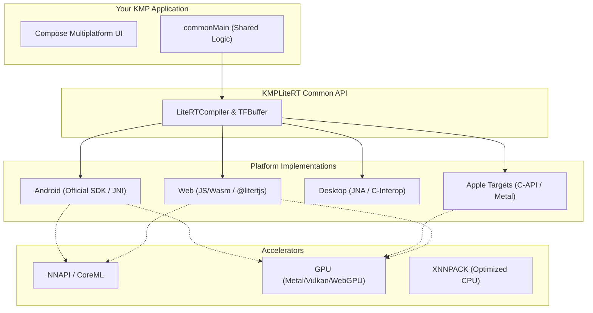

# KMPLiteRT 🚀

<p align="center">
  <b>High-performance, type-safe Kotlin Multiplatform (KMP) library for Google LiteRT (TensorFlow Lite).</b>
  <br>
  <i>Bringing on-device Machine Learning to every screen, from Mobile to Web and Desktop.</i>
</p>

<p align="center">
  <a href="https://opensource.org/licenses/Apache-2.0"></a>
  <a href="http://kotlinlang.org"></a>
  <a href="https://central.sonatype.com/artifact/io.github.leitingzi/kmplitert-core"></a>
  <a href="https://leitingzi.github.io/kmplitert/"></a>
  <a href="https://github.com/leitingzi/kmplitert/actions"></a>
</p>

---

## 📖 Table of Contents

- [🌟 Introduction](#-introduction)
- [📚 API Documentation](#-api-documentation)
- [🏗️ Architecture](#️-architecture)
- [📊 Platform Support & Acceleration](#-platform-support--acceleration)
- [📦 Installation](#-installation)
- [🍎 iOS & Native Setup (Critical)](#-ios--native-setup-critical)
- [🚀 Quick Start (Real-world Examples)](#-quick-start-real-world-examples)
  - [1. High-Level Inference (Recommended)](#1-high-level-inference-recommended)
  - [2. Low-Level Inference](#2-low-level-inference)
- [🛠️ Core API Reference](#️-core-api-reference)
  - [LiteRTCompiler](#litertcompiler)
  - [TFBuffer](#tfbuffer)
  - [LiteRTExt (Data Models)](#literext-data-models)
- [🖼️ Image Processing (LiteRtImage)](#️-image-processing-litertimage)
- [🔊 Audio Processing (LiteRtAudio)](#-audio-processing-litertaudio)
- [⚡ Extensions & Utilities](#-extensions--utilities)
- [🛑 Troubleshooting & FAQ](#-troubleshooting--faq)
- [🤝 Contributing](#-contributing)
- [📄 License](#-license)

---

## 🌟 Introduction

**KMPLiteRT** is a powerful bridge between the **Google AI Edge LiteRT** (formerly TensorFlow Lite) ecosystem and the **Kotlin Multiplatform** world. While TensorFlow Lite is the industry standard for on-device AI, integrating it into a cross-platform project often involves complex native interop, memory management issues, and inconsistent behavior across platforms.

KMPLiteRT solves these problems by providing:
- **Unified DSL**: Write your inference logic once in `commonMain` and run it anywhere.
- **Zero-Copy Performance**: Direct native memory access via `TFBuffer` ensures minimal overhead.
- **Hardware First**: Seamless integration with **Metal (Apple)**, **NNAPI (Android)**, and **WebGPU (Web)**.
- **Developer Friendly**: Type-safe APIs, coroutine support, and high-level image processing tools.

---

## 📚 API Documentation

Detailed API documentation, including module structures and function references, is available via Dokka:

👉 **[KMPLiteRT Dokka API Reference](https://leitingzi.github.io/kmplitert/)**

---

## 🏗️ Architecture

KMPLiteRT abstracts platform-specific runtimes into a consistent Kotlin interface. It doesn't just wrap the APIs; it harmonizes the data types and execution models.



---

## 📊 Platform Support & Acceleration

| Platform | Target Support | Runtime Engine | CPU (XNNPACK) | GPU Accel. | NPU Accel. |
| :--- | :--- | :--- | :---: | :---: | :---: |
| **Android** | API 21+ | Official LiteRT SDK | ✅ | ✅ (GLES) | ✅ (NNAPI) |
| **iOS** | 15.0+ | Native C-API | ✅ | ✅ (Metal) | ✅ (CoreML) |
| **macOS** | 12.0+ | Native C-API | ✅ | ✅ (Metal) | ✅ (CoreML) |
| **Windows** | x64 | Native C-API | ✅ | ✅ (Vulkan) | 🚧 |
| **Linux** | x64 / ARM64 | Native C-API | ✅ | ✅ (OpenGL) | 🚧 |
| **Web** | JS / Wasm | @litertjs/core | ✅ | ✅ (WebGPU) | ✅ (WebNN) |

---

## 📦 Installation

### 1. Add Repository & Version

Add KMPLiteRT to your `commonMain` source set in `build.gradle.kts`.

```kotlin
val kmplitertVersion = "0.2.0" // Replace with latest

kotlin {
    sourceSets {
        commonMain.dependencies {
            // The core ML runtime engine
            implementation("io.github.leitingzi:kmplitert-core:$kmplitertVersion")
            
            // Optional: Image/Audio processing & File utilities
            implementation("io.github.leitingzi:kmplitert-tool:$kmplitertVersion")
        }
    }
}
```

### 🤖 Android Setup

On Android, initialization is required to handle assets correctly:

```kotlin
class MyApp : Application() {
    override fun onCreate() {
        super.onCreate()
        // Required for LiteRTFileUtils to load models from assets
        LiteRTFileUtils.init(this)
    }
}
```

---

## 🍎 iOS & Native Setup (Critical)

Dynamic linking is **mandatory** for iOS and Apple targets to support hardware delegates like Metal and to ensure binary compatibility.

### 0. Download Prebuilt Binaries

Before configuring your project, you need the native LiteRT dynamic libraries (`.dylib` for iOS/macOS, `.so` for Linux, `.dll` for Windows).

You can download the official prebuilt C++ libraries from the **Google AI Edge LiteRT** repository:
👉 **[LiteRT Prebuilt Binaries](https://github.com/google-ai-edge/LiteRT/tree/main/litert/prebuilt)**

### 1. Framework Configuration & Binary Bundling

In your `shared` module's `build.gradle.kts`, configure your framework to be **dynamic**, link against the LiteRT binaries, and automate the bundling of `.dylib` files into the framework.

Place your LiteRT `.dylib` files in `src/nativeInterop/lib/litert/ios/arm64` and `src/nativeInterop/lib/litert/ios/sim-arm64`.

```kotlin
kotlin {
    listOf(
        iosArm64(),
        iosSimulatorArm64()
    ).forEach { iosTarget ->
        iosTarget.binaries.framework {
            baseName = "AppCore"
            isStatic = false // MUST BE FALSE to allow dynamic linking with LiteRT

            // Resolve path to the LiteRT binaries based on the target architecture
            val targetDir = when (iosTarget.konanTarget) {
                KonanTarget.IOS_ARM64 -> "ios/arm64"
                KonanTarget.IOS_SIMULATOR_ARM64 -> "ios/sim-arm64"
                else -> null
            } ?: return@framework

            val libPath = "$projectDir/src/nativeInterop/lib/litert/$targetDir"
            
            // Link against the LiteRT dynamic library
            linkerOpts("-L$libPath", "-lLiteRt", "-lc++")

            // Configure rpath for the system to find the dylib inside the framework
            linkerOpts("-Wl,-rpath,@executable_path/Frameworks")
            linkerOpts("-Wl,-rpath,@loader_path/Frameworks")

            // Copy the dylibs into the framework output directory using a dedicated Copy task
            val bundleTaskName = "bundleLiteRtTo${iosTarget.name.replaceFirstChar { it.uppercase() }}${name.replaceFirstChar { it.uppercase() }}"
            val bundleTask = tasks.register<Copy>(bundleTaskName) {
                description = "Package LiteRT dynamic libraries into the framework."
                from(libPath)
                include("*.dylib")
                into(linkTaskProvider.flatMap {
                    it.destinationDirectory.map { dir ->
                        dir.asFile.resolve("${baseName}.framework/Frameworks")
                    }
                })
            }

            // Ensure Xcode assembly tasks depend on our bundling task
            tasks.matching {
                (it.name.startsWith("assemble") || it.name.startsWith("embedAndSign")) && 
                it.name.contains(iosTarget.name, ignoreCase = true) &&
                it.name.contains("AppleFrameworkForXcode")
            }.configureEach {
                dependsOn(bundleTask)
            }
        }
    }
}
```

---

## 🚀 Quick Start (Real-world Examples)

### 1. High-Level Inference (Recommended)

The best way to implement a model is by inheriting from `LiteRTHandler`. It handles the orchestration and lifecycle for you.

```kotlin
import io.github.kmplitert.core.*
import io.github.kmplitert.tool.*
import io.github.kmplitert.tool.image.LiteRtImage
import io.github.kmplitert.tool.expand.*

// I: Input, O: Output
class MyClassifier : LiteRTHandler<LiteRtImage, List<LiteRTExt.Category>>() {
    private val labels = listOf("Cat", "Dog", "Bird")

    override suspend fun init() {
        // Setup compiler with model path and accelerator
        setupCompiler("path/to/model.tflite", LiteRTAccelerator.CPU)
    }

    override suspend fun preprocess(input: LiteRtImage, inputBuffers: List<TFBuffer>) {
        // 1. Resize, transform image format and feed to native buffer
        val resized = input.resize(224, 224).toRgb()
        resized.writeFloatBuffer(inputBuffers[0], mean = 127.5f, std = 127.5f)
    }

    override suspend fun postprocess(outputBuffers: List<TFBuffer>): List<LiteRTExt.Category> {
        // 2. Read output and convert to high-level Category models
        val scores = outputBuffers[0].readFloat()
        return scores.toCategories(labels, threshold = 0.5f)
    }
    
    suspend fun classify(image: LiteRtImage) = runTask(image)
}
```

### 2. Low-Level Inference

For manual control, use `LiteRTCompiler` and extensions for idiomatic Kotlin.

```kotlin
import io.github.kmplitert.core.*
import io.github.kmplitert.tool.expand.*

suspend fun simpleInference(modelPath: String) {
    // 1. Initialize Compiler with DSL-like 'use' block for auto-cleanup
    LiteRTCompiler(modelPath, LiteRTAccelerator.CPU).use { compiler ->
        compiler.init()

        // 2. Prepare I/O Buffers
        val inputs = compiler.getInputBuffers()
        val outputs = compiler.getOutputBuffers()

        // 3. Write input data using extensions
        floatArrayOf(1.0f, 2.0f, 3.0f).writeTo(inputs[0])

        // 4. Run inference
        compiler.run(inputs, outputs)

        // 5. Read result directly
        val result = outputs[0].readFloat()
        println("Inference result: ${result.joinToString()}")
    }
}
```

---

## 🛠️ Core API Reference

### `LiteRTHandler<I, O>`
Primary base class for model implementation, providing orchestration, lifecycle management, and interceptor support.

- **Status Tracking**: Monitor the lifecycle via the `status: StateFlow<Status>` property. States include `Idle`, `Initializing`, `Ready`, `Running`, `Closing`, and `Error`.
- **Threading Control**: Use `setDispatcher(CoroutineDispatcher)` to specify the execution context (default is `Dispatchers.Default`).
- **Interceptor Chain**: Extend functionality (logging, caching, etc.) using `addInterceptor`, `removeInterceptor`, and `clearInterceptors`.
- **Execution**: `runTask(input)` orchestrates `preprocess -> run -> postprocess` through all registered interceptors.
- **Lifecycle**: `close()` safely releases native resources and resets the state.

### `LiteRTCompiler`
The engine managing the native model.
- `run(inputs, outputs)`: Executes raw inference.
- `getInputBuffers()` / `getOutputBuffers()`: Pre-allocates native buffers.

### `LiteRTExt` (Common Models)
Foundational data structures in `io.github.kmplitert.tool`:
- **General**: `Category`, `BoundingBox`, `Detection`.
- **Vision**: `Face.Result`, `Hand.Gesture`, `Pose.Result`.
- **Segmentation**: `Segmentation.Mask`.
- **NLP**: `Nlp.Tokenizer` interface.
- **OCR**: `Text.Result`, `Text.Block`, `Text.Line`.
- **Video**: `Video.Frame`.

---

## 🖼️ Image Processing (`LiteRtImage`)
Located in `io.github.kmplitert.tool.image`, provides a fluent API:
```kotlin
val processedImage = LiteRtImage.fromBytes(bytes)
    .resize(320, 320)
    .rotate(90f) // Degrees as Float
    .flip(horizontal = true, vertical = false)
    .toRgb()

// Efficiently write to buffer
processedImage.writeFloatBuffer(buffer, mean = 0f, std = 255f)
```

---

## 🔊 Audio Processing (`LiteRtAudio`)
New in `io.github.kmplitert.tool.audio`, simplifies audio tasks:
```kotlin
import io.github.kmplitert.tool.audio.*

// Decode WAV file
val audio = WavDecoder.decode(wavBytes)
val pcmData = audio.data // FloatArray

// Basic signal processing
val normalized = SignalProcessing.normalize(pcmData)
```

---

## ⚡ Extensions & Utilities
The `io.github.kmplitert.tool.expand` and `io.github.kmplitert.tool.interceptor` packages provide powerful tools:

### Middleware & Interceptors

You can inject logic into the inference pipeline using interceptors. This is ideal for logging, caching, performance monitoring, or result filtering.

#### Using Built-in Interceptors
```kotlin
val handler = MyClassifier().apply {
    // 1. Result Caching: Skip inference if input fingerprint matches last result
    addCache(onCacheHit = { input, result -> println("Cache hit!") })

    // 2. Logging: Measure and log execution time for each phase
    addLogging(tag = "MyModel", phase = LiteRTPhase.TASK)
}
```

#### Creating Custom Interceptors
Interceptors are type-safe and allow you to wrap the execution at different phases.

```kotlin
class MyCustomInterceptor : LiteRTInterceptor<LiteRtImage, List<Category>> {
    override suspend fun intercept(
        chain: LiteRTInterceptor.Chain<LiteRtImage, List<Category>>
    ): List<Category> {
        // 1. Pre-processing logic (e.g., validate input)
        if (chain.input.width < 100) throw Exception("Image too small")

        // 2. Proceed to the next interceptor or the actual task
        val startTime = currentTimeMillis()
        val results = chain.proceed()
        val duration = currentTimeMillis() - startTime

        // 3. Post-processing logic (e.g., filter results)
        println("Task took ${duration}ms")
        return results.filter { it.score > 0.5f }
    }
}

// Add to your handler
handler.addInterceptor(MyCustomInterceptor(), phase = LiteRTPhase.TASK)
```

#### LiteRTPhases
You can attach interceptors to specific execution stages:
- **`TASK`**: Wraps the entire process (default).
- **`TRANSFORM`**: Wraps the data transformation (`transform` method).
- **`FEED`**: Wraps the data loading into native buffers (`feed` method).
- **`INFERENCE`**: Wraps the actual model execution.
- **`POSTPROCESS`**: Wraps the result parsing (`postprocess` method).

### Core Extensions
- **Buffer Ops**: `TFBuffer.writeTo(array)`, `TFBuffer.toFloatArray()`.
- **Post-processing**: `FloatArray.argmax()`, `FloatArray.softmax()`, `FloatArray.toCategories(...)`.
- **NMS**: `performNms(boxes, scores, threshold)` for object detection.

---

## 🤝 Contributing

1. Fork the Project
2. Create your Feature Branch (`git checkout -b feature/AmazingFeature`)
3. Commit your Changes (`git commit -m 'Add some AmazingFeature'`)
4. Push to the Branch (`git push origin feature/AmazingFeature`)
5. Open a Pull Request

---

## 📄 License

Distributed under the **Apache License, Version 2.0**. See `LICENSE` for more information.

---

<p align="center">
  Built with ❤️ for the Kotlin Multiplatform community.
</p>
