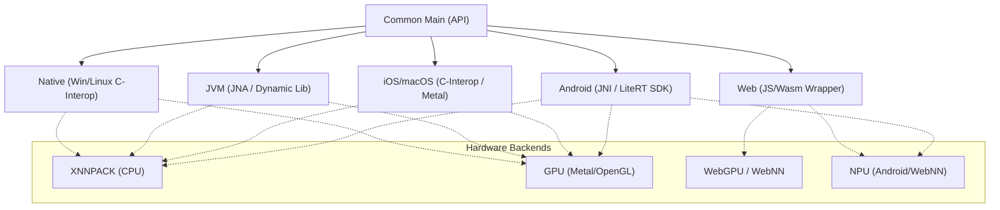

# KMPLiteRT 🚀

[](https://opensource.org/licenses/Apache-2.0)
[](http://kotlinlang.org)
[](https://central.sonatype.com/artifact/io.github.leitingzi/kmplitert-core)
[](https://github.com/leitingzi/kmplitert/actions)

**KMPLiteRT** is a high-performance, type-safe Kotlin Multiplatform (KMP) library that brings **Google LiteRT** (formerly TensorFlow Lite) to the multiplatform ecosystem. It enables developers to execute machine learning models with native performance on Android, iOS, JVM, Native (Desktop), and Web platforms using a single, unified codebase.

---

## 🌟 Why KMPLiteRT?

- **Native Performance**: Leverages platform-specific LiteRT runtimes (JNI on Android, C-API on iOS/Desktop, Wasm on Web) for maximum speed.
- **Unified DSL**: A consistent, coroutine-first Kotlin API that abstracts away the complexity of native interop.
- **Hardware Acceleration**: Out-of-the-box support for GPU (Metal/OpenGL/WebGPU), NPU (NNAPI/WebNN), and XNNPACK.
- **Type-Safe & Efficient**: Optimized memory management with `TFBuffer` prevents data copying overhead.
- **Battery Included**: High-level Task APIs for Vision (Classification/Detection) and an Image Preprocessing toolkit.

---

## 🏗️ Architecture

KMPLiteRT abstracts platform-specific LiteRT runtimes into a consistent Kotlin DSL. It handles the complexity of native interop, memory management, and hardware acceleration backends.



---

## 📊 Platform & Hardware Acceleration Matrix

| Platform | Runtime Base | CPU (XNNPACK) | GPU Acceleration | NPU / AI Accelerator |
| :--- | :--- | :---: | :---: | :---: |
| **Android** | LiteRT Android SDK | ✅ | ✅ (OpenGL ES) | ✅ (NNAPI) |
| **iOS** | LiteRT C-API | ✅ | ✅ (Metal) | ✅ (CoreML via Metal) |
| **macOS** | LiteRT C-API | ✅ | ✅ (Metal) | ✅ (CoreML) |
| **Windows** | LiteRT C-API | ✅ | ✅ (Vulkan) | 🚧 (Planning) |
| **Linux** | LiteRT C-API | ✅ | ✅ (OpenGL) | 🚧 (Planning) |
| **JVM** | JNA + C-API | ✅ | ✅ (Platform specific) | 🚧 (Planning) |
| **Web** | `@litertjs/core` | ✅ | ✅ (WebGPU) | ✅ (WebNN) |

---

## 📦 Installation

### 1. Common Configuration

Add the dependencies to your `commonMain` source set in your `build.gradle.kts`:

```kotlin
val kmplitertVersion = "0.1.4" // Replace with the latest version

kotlin {
    sourceSets {
        commonMain.dependencies {
            // Core ML runtime
            implementation("io.github.leitingzi:kmplitert-core:$kmplitertVersion")
            
            // Optional image preprocessing and task APIs
            implementation("io.github.leitingzi:kmplitert-tool:$kmplitertVersion")
        }
    }
}
```

### 🤖 Android Setup

On Android, KMPLiteRT wraps the official Google LiteRT Android SDK.

1.  **Dependency**: Handled by `commonMain`.
2.  **Initialization**: If you use `LiteRTFileUtils` for model loading from assets/resources, initialize it in your `Application` or `Activity`:

```kotlin
// In MainActivity.kt or Application.kt
override fun onCreate(savedInstanceState: Bundle?) {
    super.onCreate(savedInstanceState)
    // Required for file-based model loading on Android
    LiteRTFileUtils.init(applicationContext)
}
```

### 🍎 iOS & Apple Targets Setup (Native Interop)

Native targets require explicit linking against the LiteRT dynamic library (`.dylib`). This is the most critical part of the setup.

> [!IMPORTANT]
> Because KMPLiteRT uses dynamic linking for better integration with the native runtime, you must ensure the `.dylib` files are bundled within your app's `Frameworks` directory and the `rpath` is correctly configured.

#### Step 1: Framework Configuration

In your `shared` or `core` module's `build.gradle.kts`, configure your iOS targets to use dynamic linking and set the correct linker flags:

```kotlin
kotlin {
    val iosTargets = listOf(iosArm64(), iosSimulatorArm64())
    
    iosTargets.forEach { target ->
        target.binaries.framework {
            baseName = "AppCore"
            isStatic = false // MANDATORY: Dynamic linking for LiteRT
            
            // 1. Link against the LiteRt C API library
            linkerOpts("-lLiteRt", "-lc++")
            
            // 2. Configure rpath so the system can find the bundled dylib at runtime
            // This ensures the framework looks in its own 'Frameworks' subfolder
            linkerOpts("-Wl,-rpath,@executable_path/Frameworks")
            linkerOpts("-Wl,-rpath,@loader_path/Frameworks")
            linkerOpts("-Wl,-rpath,@loader_path/../../Frameworks")
        }
    }
}
```

#### Step 2: Bundling Native Binaries

You must manually (or via a Gradle task) bundle the `libLiteRt.dylib` into your `.framework` package. KMPLiteRT provides the binaries in the `core` module. Here is how to automate the bundling:

```kotlin
// In your shared build.gradle.kts
tasks.withType<org.jetbrains.kotlin.gradle.tasks.KotlinNativeLink>().configureEach {
    val target = binary.target.konanTarget
    val isIos = target == org.jetbrains.kotlin.konan.target.KonanTarget.IOS_ARM64 || 
                target == org.jetbrains.kotlin.konan.target.KonanTarget.IOS_SIMULATOR_ARM64

    if (isIos) {
        doLast {
            val destination = destinationDirectory.get().asFile
            val frameworkDir = File(destination, "${binary.baseName}.framework")
            val frameworksFolder = File(frameworkDir, "Frameworks").apply { mkdirs() }
            
            // Path to prebuilt dylibs in KMPLiteRT core
            val libPath = File(project.rootDir, "core/src/nativeInterop/lib/litert/ios/${if (target.name.contains("simulator")) "sim-arm64" else "arm64"}")
            
            copy {
                from(libPath)
                include("*.dylib")
                into(frameworksFolder)
            }
        }
    }
}
```

### 💻 Desktop (Windows/Linux/macOS) Setup

#### JVM (Java/Kotlin Desktop)
The JVM target uses JNA (Java Native Access). The prebuilt binaries are usually packaged within the `kmplitert-core` JAR. However, for custom environments:
- **Windows**: Put `libLiteRt.dll` in the same directory as your `.exe` or in `C:\Windows\System32`.
- **Linux/macOS**: Ensure the library is in `LD_LIBRARY_PATH` or `DYLD_LIBRARY_PATH`.

#### Native (Kotlin/Native)
Similar to iOS, use `linkerOpts` to point to the library and set `rpath`:

```kotlin
mingwX64 {
    binaries.executable {
        linkerOpts("-L${projectDir}/libs/windows", "-lLiteRt")
    }
}

linuxX64 {
    binaries.executable {
        linkerOpts("-L${projectDir}/libs/linux", "-lLiteRt")
        linkerOpts("-Wl,-rpath,\$ORIGIN/libs") // Search for libs in a relative path
    }
}
```

### 🌐 Web (Wasm/JS) Setup

The Web target uses `@litertjs/core`. Ensure you have the following in your dependencies:

```kotlin
// build.gradle.kts
kotlin {
    js(IR) { browser() }
    wasmJs { browser() }
    
    sourceSets {
        val commonMain by getting {
            dependencies {
                implementation(npm("@litertjs/core", "2.5.2"))
            }
        }
    }
}
```

---

## 🚀 Quick Start

### Basic Inference (Numeric)

The following example shows how to run a simple model that converts Celsius to Fahrenheit.

```kotlin
import io.github.kmplitert.core.*

suspend fun runInference() {
    // 1. Create the compiler (engine)
    // You can load from a file path or use Res.readBytes() from Compose Resources
    val compiler = LiteRTCompiler(filePath = "model.tflite", accelerator = LiteRTAccelerator.CPU)
    
    // 2. Initialize the native runtime
    compiler.init()

    // 3. Prepare input and output buffers
    val inputs = compiler.getInputBuffers()
    val outputs = compiler.getOutputBuffers()

    // 4. Write data to the input tensor
    // For a single float input:
    inputs[0].writeFloat(floatArrayOf(100f)) // 100°C

    // 5. Execute inference
    compiler.run(inputs = inputs, outputs = outputs)

    // 6. Read the results
    val result = outputs[0].readFloat()
    println("Result in Fahrenheit: ${result[0]}")

    // 7. Always close to release native memory!
    compiler.close()
}
```

---

## 🖼️ Computer Vision with `kmplitert-tool`

The `tool` module provides high-level utilities for image processing and model input preparation.

### Image Preprocessing Pipeline

```kotlin
import io.github.kmplitert.tool.*

// Load an image (e.g., from Compose Resources or File)
val rawBytes = Res.readBytes("files/image.png")

// Create a LiteRtImage and apply transformations
val processedData = LiteRtImage.fromBytes(rawBytes)
    .resize(224, 224) // Resize to model input size
    .toRgb()          // Convert to RGB
    .toInt8Array()    // Convert to Int8 (for quantized models)

// Or for float models:
val floatData = LiteRtImage.fromBytes(rawBytes)
    .resize(224, 224)
    .toRgb()
    .toFloatArray(mean = 127.5f, std = 127.5f) // Normalize to [-1, 1]
```

### Complete MobileNet Example

```kotlin
suspend fun identifyImage() {
    val compiler = LiteRTCompiler("mobilenet.tflite")
    compiler.init()

    val inputs = compiler.getInputBuffers()
    val outputs = compiler.getOutputBuffers()

    // Prepare image using the tool
    val imageData = LiteRtImage.fromBytes(myImageBytes)
        .resize(224, 224)
        .toRgb()
        .writeInt8Buffer(inputs[0]) // Directly write to TFBuffer for efficiency

    // Run
    compiler.run(inputs, outputs)

    // Read result
    val predictions = outputs[0].readInt8()
    val topClass = predictions.indices.maxBy { predictions[it] }
    
    println("Identified class index: $topClass")
    compiler.close()
}
```

---

## 🛠️ Advanced Features

### Hardware Accelerators

KMPLiteRT makes it easy to leverage platform hardware. It abstracts delegates like NNAPI (Android), Metal (iOS/macOS), and WebGPU (Web).

```kotlin
val accelerator = when {
    isAndroid -> LiteRTAccelerator.NPU // Uses NNAPI
    isApple -> LiteRTAccelerator.GPU   // Uses Metal
    else -> LiteRTAccelerator.CPU      // Default XNNPACK
}

val compiler = LiteRTCompiler(modelPath, accelerator)
```

### Memory Management with `TFBuffer`

To avoid overhead, KMPLiteRT uses `TFBuffer` which wraps native memory directly.

- **`writeInt8` / `writeFloat`**: Copies data from Kotlin arrays to native memory.
- **`readInt8` / `readFloat`**: Copies data from native memory back to Kotlin arrays.
- **`writeInt8Buffer`**: Specialized tool API to write directly from an image pipeline to a tensor buffer.

### Metadata Inspection

Inspect your model's tensors at runtime to ensure compatibility:

```kotlin
val inputRequirements = compiler.getInputBufferRequirements("input_tensor_name")
println("Name: ${inputRequirements.name}")
println("Shape: ${inputRequirements.shape.joinToString()}")
println("Byte size: ${inputRequirements.byteSize}")

val tensorType = compiler.getInputTensorType("input_tensor_name")
// Returns LiteRTElementType (FLOAT32, INT8, UINT8, INT32, etc.)
```

---

## 🧪 Testing and Verification

KMPLiteRT includes a robust testing framework to ensure your models perform identically across all platforms.

### Cross-Platform Model Tests

You can define a test once in `commonTest` and it will run on Android, iOS, JVM, and Web:

```kotlin
class MyModelTest {
    @Test
    fun testConsistency() = runTest {
        val config = ModelTestConfig(
            name = "MobileNetV2",
            modelBytes = loadResource("mobilenet.tflite"),
            inputs = listOf(
                TensorExpectation(
                    name = "input",
                    type = LiteRTElementType.FLOAT32,
                    data = generateTestData(1, 224, 224, 3)
                )
            ),
            outputs = listOf(
                TensorExpectation(
                    name = "output",
                    type = LiteRTElementType.FLOAT32,
                    expectedSum = 1.0f // Probabilities sum to 1
                )
            )
        )
        
        // This helper executes the model on the current platform's native runtime
        runModelInferenceTest(config)
    }
}
```

---

## 🛑 Troubleshooting

### Common Issues

| Issue | Solution |
| :--- | :--- |
| **`Library not found: libLiteRt.dylib`** | Ensure the dylib is in the `Frameworks` folder and `rpath` is configured. On iOS, verify the "Embed & Sign" setting if using Xcode directly. |
| **`Unsupported element type`** | Some older models use `INT64` or `BOOL` which might not be mapped in all platform backends. Try using `FLOAT32`. |
| **`Model failed to initialize`** | On Android, the model must be a real file on disk. Use `LiteRTFileUtils.createFileFromByteArray(bytes)` to save a temp file. |
| **`NPU not available`** | NPU (NNAPI) is only available on supported Android devices (API 27+). Fall back to `CPU`. |

### Performance Tips

1.  **Reuse Compiler**: Initializing `LiteRTCompiler` is expensive. Keep an instance alive for multiple inferences.
2.  **Thread Count**: For CPU inference, adjusting the thread count (if supported by the backend) can significantly improve speed on multi-core devices.
3.  **Quantization**: Use `INT8` quantized models for mobile devices to reduce model size and improve inference speed on NPUs.
4.  **Buffer Reuse**: Do not re-allocate `TFBuffer`s. Use `compiler.getInputBuffers()` once and keep them.

---

## 🤝 Contributing

We welcome contributions from the community! Whether it's fixing bugs, adding new platforms, or improving documentation.

1.  **Report Issues**: Use the GitHub Issues tracker.
2.  **Submit PRs**: 
    - Ensure your code follows the project's style guide.
    - Add tests for new features.
    - Update the documentation if necessary.

---

## 📄 License

```text
Copyright 2026 yebintang

Licensed under the Apache License, Version 2.0 (the "License");
you may not use this file except in compliance with the License.
You may obtain a copy of the License at

    http://www.apache.org/licenses/LICENSE-2.0

Unless required by applicable law or agreed to in writing, software
distributed under the License is distributed on an "AS IS" BASIS,
WITHOUT WARRANTIES OR CONDITIONS OF ANY KIND, either express or implied.
See the License for the specific language governing permissions and
limitations under the License.
```

---

<p align="center">
  <b>KMPLiteRT</b> - Bringing the power of Machine Learning to every platform.
  <br>
  Developed and maintained by <b>yebintang</b>.
</p>
