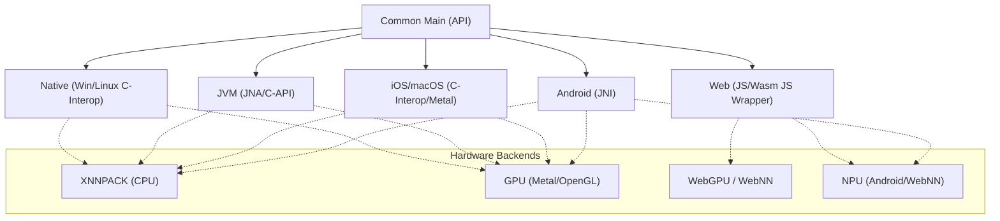

# KMPLiteRT 🚀

[](https://opensource.org/licenses/Apache-2.0)
[](http://kotlinlang.org)
[](https://central.sonatype.com/artifact/io.github.leitingzi/kmplitert-core)
[](https://github.com/leitingzi/kmplitert/actions)

**KMPLiteRT** is a high-performance, type-safe Kotlin Multiplatform (KMP) library that brings **Google LiteRT** (formerly TensorFlow Lite) to the multiplatform ecosystem. It enables developers to execute machine learning models with native performance on Android, iOS, JVM, Native (Desktop), and Web platforms using a single, unified codebase.

---

## 🌟 Why KMPLiteRT?

- **Native Performance**: Leverages platform-specific LiteRT runtimes (JNI on Android, C-API on iOS/Desktop, Wasm on Web) for maximum speed.
- **Unified DSL**: A consistent, coroutine-first Kotlin API that abstracts away the complexity of native interop.
- **Hardware Acceleration**: Out-of-the-box support for GPU (Metal/OpenGL/WebGPU), NPU (NNAPI/WebNN), and XNNPACK.
- **Type-Safe & Efficient**: Optimized memory management with `TFBuffer` prevents data copying overhead.
- **Battery Included**: High-level Task APIs for Vision (Classification/Detection) and an Image Preprocessing toolkit.

---

## 🏗️ Architecture

KMPLiteRT abstracts platform-specific LiteRT runtimes into a consistent Kotlin DSL. It handles the complexity of native interop, memory management, and hardware acceleration backends.



---

## ✨ Key Features

- **Unified Inference Engine**: Orchestrate models, tensors, and signatures using a single API across all targets.
- **High-Level Task APIs**: Ready-to-use `ImageClassifier` and `ObjectDetector` for common Vision tasks.
- **Image Processing Toolkit**: `kmplitert-tool` provides a KMP DSL for image resizing, cropping, and model-ready normalization.
- **Metadata Inspection**: Fully inspect model input/output layouts, dimensions, strides, and buffer requirements at runtime.
- **Coroutine-First**: All lifecycle methods (`init`, `run`, `read`) are suspending and designed for non-blocking workflows.

---

## 📊 Platform & Hardware Acceleration Matrix

| Platform | Core Implementation | CPU (XNNPACK) | GPU | NPU / AI Accelerator |
| :--- | :--- | :---: | :---: | :---: |
| **Android** | LiteRT Android SDK (JNI) | ✅ | ✅ (OpenGL) | ✅ (NNAPI/NPU) |
| **iOS / MacOS** | LiteRT C-API + C-Interop | ✅ | ✅ (Metal) | ✅ (CoreML via Metal) |
| **JVM (Desktop)** | JNA + Dynamic Library | ✅ | ✅ (Vulkan/GL) | 🚧 (Planning) |
| **Native (Win/Linux)** | LiteRT C-API + C-Interop | ✅ | ✅ (WebGPU/GL) | 🚧 (Planning) |
| **Web (JS/Wasm)** | `@litertjs/core` Wrapper | ✅ | ✅ (WebGPU) | ✅ (WebNN) |

---

## 📦 Installation

Add the dependencies to your `commonMain` source set in your `build.gradle.kts`:

```kotlin
val kmplitertVersion = "0.1.4"

kotlin {
    sourceSets {
        commonMain.dependencies {
            // Core ML runtime
            implementation("io.github.leitingzi:kmplitert-core:$kmplitertVersion")
            
            // Optional image preprocessing and task APIs (Classification, Detection)
            implementation("io.github.leitingzi:kmplitert-tool:$kmplitertVersion")
        }
    }
}
```

---

## 🚀 Quick Start

Loading a model and running inference in just a few lines:

```kotlin
import io.github.leitingzi.kmplitert.core.*

val compiler = LiteRTCompiler("model.tflite", LiteRTAccelerator.CPU)
compiler.init() // Initialize native runtime

val inputs = compiler.getInputBuffers()
val outputs = compiler.getOutputBuffers()

// Write data, run inference, and read results
inputs[0].writeFloat(floatArrayOf(1.0f, 2.0f, 3.0f))
compiler.run(inputs, outputs)
val results = outputs[0].readFloat()

compiler.close() // Release native resources
```

---

## 🛠️ High-Level Task APIs (`kmplitert-tool`)

Skip the boilerplate and use pre-built APIs for common machine learning tasks.

### Image Classification
```kotlin
val classifier = ImageClassifier.create("mobilenet.tflite")
val image = LiteRtImage.fromBytes(byteArray)

val results = classifier.classify(image)
results.forEach { println("${it.label}: ${it.score}") }
```

### Object Detection
```kotlin
val detector = ObjectDetector.create("ssd_mobilenet.tflite")
val image = LiteRtImage.fromBytes(byteArray)

val detections = detector.detect(image)
detections.forEach { 
    println("Detected ${it.categories[0].label} at ${it.boundingBox}")
}
```

---

## 🖼️ Image Preprocessing Pipeline

Prepare raw image data for computer vision models using the fluent API.

```kotlin
import io.github.leitingzi.kmplitert.tool.*

val modelInputData = LiteRtImage.fromBytes(rawImageData)
    .resize(width = 224, height = 224)
    .centerCrop(224, 224)
    .toRgb()
    .toFloatArray(mean = 127.5f, std = 127.5f) // Normalize to [-1, 1]
```

---

## 📱 Sample Applications

Check out the `app/` directory for full-featured samples across all supported platforms:

- [**Android App**](file:///app/androidApp): Real-time camera classification using Jetpack Compose.
- [**Desktop App**](file:///app/desktopApp): Multi-window inference UI for Windows, macOS, and Linux.
- [**Web App**](file:///app/webApp): Browser-based ML powered by Wasm and WebGPU.

---

## 🧪 Model Verification Pipeline

Ensure your model behaves identically across all platforms using our generic testing framework.

```kotlin
class MyModelTest {
    @Test
    fun testConsistency() = runTest {
        val config = ModelTestConfig(
            name = "MobileNet",
            modelBytes = loadResourceAsBytes("mobilenet.tflite"),
            inputs = listOf(TensorExpectation("input", LiteRTElementType.FLOAT, testData = ...)),
            outputs = listOf(TensorExpectation("output", LiteRTElementType.FLOAT, expectedValue = ...))
        )
        // Runs on Android, JVM, Native, and Web!
        runModelInferenceTest(config) 
    }
}
```

---

## 🤝 Contributing

Contributions are welcome! Please feel free to submit a Pull Request.

1. Fork the Project
2. Create your Feature Branch (`git checkout -b feature/AmazingFeature`)
3. Commit your Changes (`git commit -m 'Add some AmazingFeature'`)
4. Push to the Branch (`git push origin feature/AmazingFeature`)
5. Open a Pull Request

---

## 📄 License

Distributed under the Apache License, Version 2.0. See `LICENSE` for more information.

---
<p align="center">
  Maintained with ❤️ for the Kotlin Multiplatform community.
</p>
